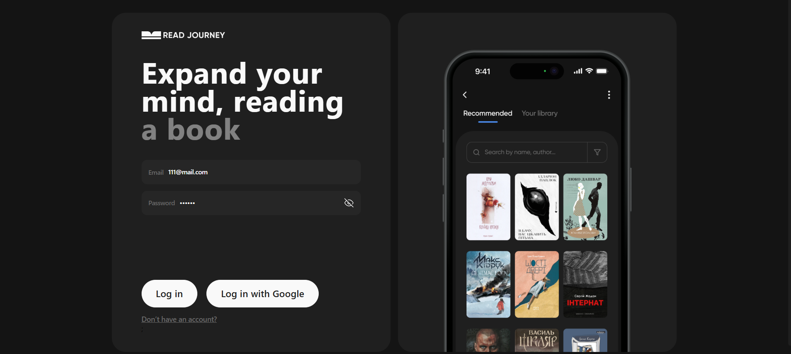

# READ JOURNEY

[Live Page](https://read-journey-app-eta.vercel.app/)

## Project description

Welcome to "Read Journey" repository that contains source code and
assets for this website! It is a personal reading diary designed to help book enthusiasts track, manage, and reflect on their reading habits. With this app, users can log books they’ve read, save books they want to explore, and document their progress along their literary journey.

## 📊 Features

- #### Variety of Books
Explore a wide range of books curated just for you.
Add recommended books to your library with a single click.

- #### Organized Digital Library
Keep your book collection well-organized.
Easily manage books you plan to read, are currently reading, or have already finished.

- #### Reading Progress Tracking
Track your reading progress for each book.
Use visual progress bars, daily updates, and completion percentages to stay motivated.

- #### Detailed Statistics and Insights
Get a clear overview of your reading habits and achievements.
See useful details like the number of books you’ve completed, your progress percentages, and more.

## 🔍 Accessibility

- Intuitive design
- Semantic HTML
- Mobile-Friendly
- The web resource is available for any device with an Internet connection

## 🛠️ Technologies Used

- React
- Styled Components
- Firebase
- Axios
- TypeScript
- React Hook Form
- React responsive
- Chart.js
- React Slick
- Yup